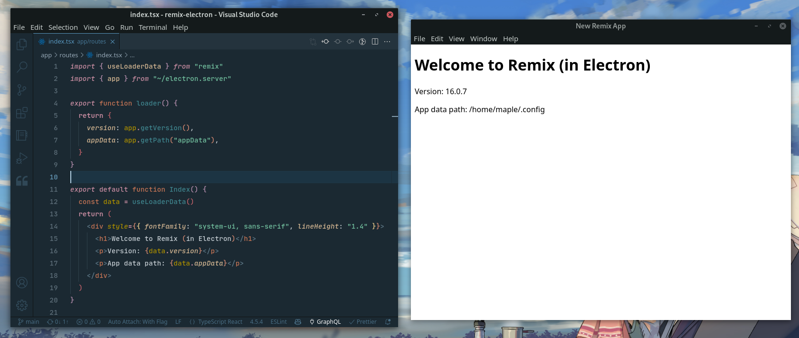

# remix-electron

Electron integration for Remix



## Setup

Use degit to create a new project from the template.

```sh
npx degit itsMapleLeaf/remix-electron/template my-desktop-app
```

### Adding to an existing Remix project

Install remix-electron and peer dependencies:

```bash
npm i remix-electron electron @remix-run/node @remix-run/server-runtime react react-dom
```

Add a file at `desktop/main.ts` to run the electron app. The `initRemix` function returns a url to load in the browser window.

```ts
// desktop/main.ts
import * as serverBuild from "@remix-run/dev/server-build"
import { app, BrowserWindow } from "electron"
import { initRemix } from "remix-electron"

let win: BrowserWindow | undefined

app.on("ready", async () => {
  try {
    const url = await initRemix({ serverBuild })

    win = new BrowserWindow({ show: false })
    await win.loadURL(url)
    win.show()
  } catch (error) {
    console.error(error)
  }
})
```

Update your Remix config:

```js
// remix.config.js
/**
 * @type {import('@remix-run/dev/config').AppConfig}
 */
module.exports = {
  // point this to your electron entry file
  server: "desktop/main.ts",

  // this is the file that will be run by electron
  serverBuildPath: "desktop/build/index.js",

  // everything else can stay the same
  appDirectory: "app",
  assetsBuildDirectory: "public/build",
  publicPath: "/build/",
  devServerPort: 8002,
  ignoredRouteFiles: [".*"],
}
```

Build the app with `npm run build`, then run `npx electron desktop/build/index.js` to start the app! 🚀

## Using Electron APIs

Importing `"electron"` directly in route files results in Electron trying to get bundled and called in the browser / renderer process.

To circumvent this, create a `electron.server.js` file, which re-exports from electron. The `.server` suffix tells Remix to only load it in the main process. You should use `.server` for any code that runs in the main process and uses node/electron APIs.

```js
// app/electron.server.js
export * from "electron"
```

> **Note for TypeScript users:** The way that the Electron definitions are written doesn't let you do this in a .ts file. Instead, add this `.d.ts` file next to the `.js` file:
>
> ```ts
> // app/electron.server.d.ts
> import * as electron from "electron"
> export = electron
> ```

Likewise, for any code running in the renderer process, e.g. using the [clipboard](https://www.electronjs.org/docs/latest/api/clipboard) module, you can use the `.client` suffix. Renderer process modules require `nodeIntegration`.

```js
// desktop/main.ts
function createWindow() {
  // ...
  win = new BrowserWindow({
    // ...
    webPreferences: {
      nodeIntegration: true,
    },
  })
}
```

## API

### `initRemix({ remixConfig[, mode, getLoadContext] })`

Initializes remix-electron. Returns a promise with a url to load in the browser window.

Options:

- `remixConfig`: The remix config object. Require it from `remix.config.js`.

- `mode`: The mode the app is running in. Can be `"development"` or `"production"`. Defaults to `"production"` when packaged, otherwise uses `process.env.NODE_ENV`.

- `getLoadContext`: Use this to inject some value into all of your remix loaders, e.g. an API client. The loaders receive it as `context`

<details>
<summary>Load context TS example</summary>

**app/context.ts**

```ts
import type * as remix from "@remix-run/server-runtime"

// your context type
export type LoadContext = {
  secret: string
}

// a custom data function args type to use for loaders/actions
export type DataFunctionArgs = Omit<remix.DataFunctionArgs, "context"> & {
  context: LoadContext
}
```

**desktop/main.ts**

```ts
import type { LoadContext } from "~/context"

const url = await initRemix({
  remixConfig,
  getLoadContext: (): LoadContext => ({
    secret: "123",
  }),
})
```

In a route file:

```ts
import type { DataFunctionArgs, LoadContext } from "~/context"

export async function loader({ context }: DataFunctionArgs) {
  // do something with context
}
```

</details>

## Motivation

Electron has [a comprehensive list of security recommendations](https://www.electronjs.org/docs/latest/tutorial/security) to follow when building an app, especially if that app interacts with the web. Which includes, but is not limited to:

- Using `preload.js` files to expose specific electron functionality to your app, via globals
- Using IPC communication
- Avoiding `remote.require` (which has since been removed)

These practices can lead to a lot of awkward boilerplate and splitting up related code across multiple files and domains.

With `remix-electron`, you can freely use Electron APIs in Remix loader functions. It's a Node process with full Node capabilities, with access to the full Electron API, none of which runs in the browser.

The browser only receives data and renders a view. Additionally, you can neatly colocate your main process code right beside the related renderer code in a route file.

Thinking about it another way: it's like a normal Remix web app, except Electron is your backend.
